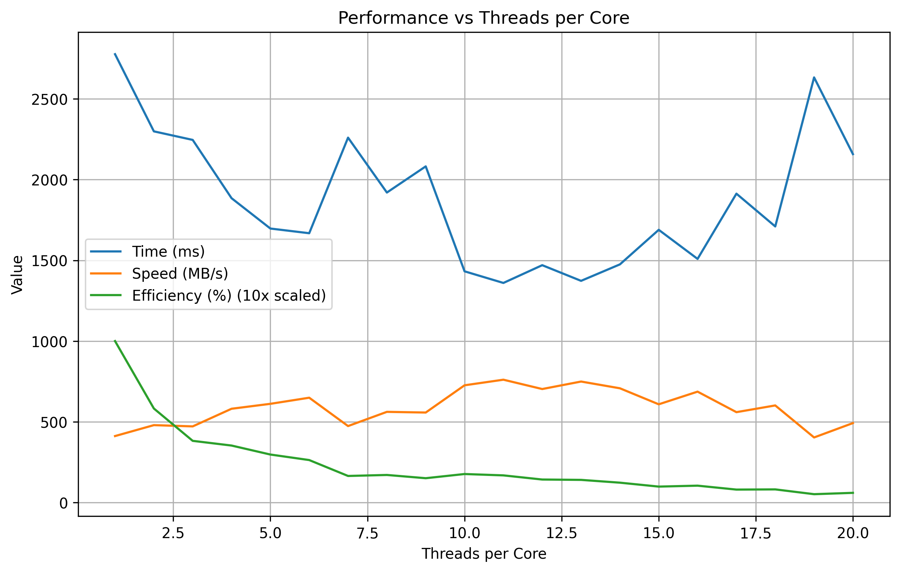
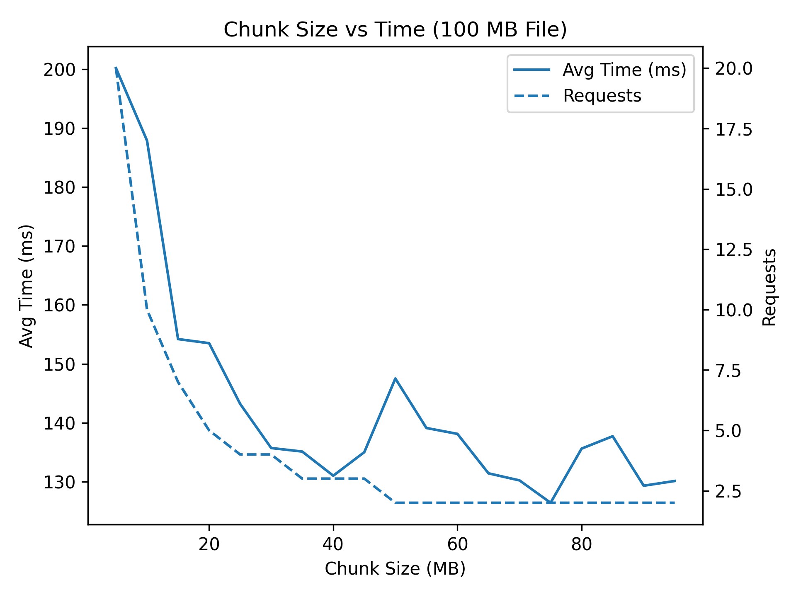
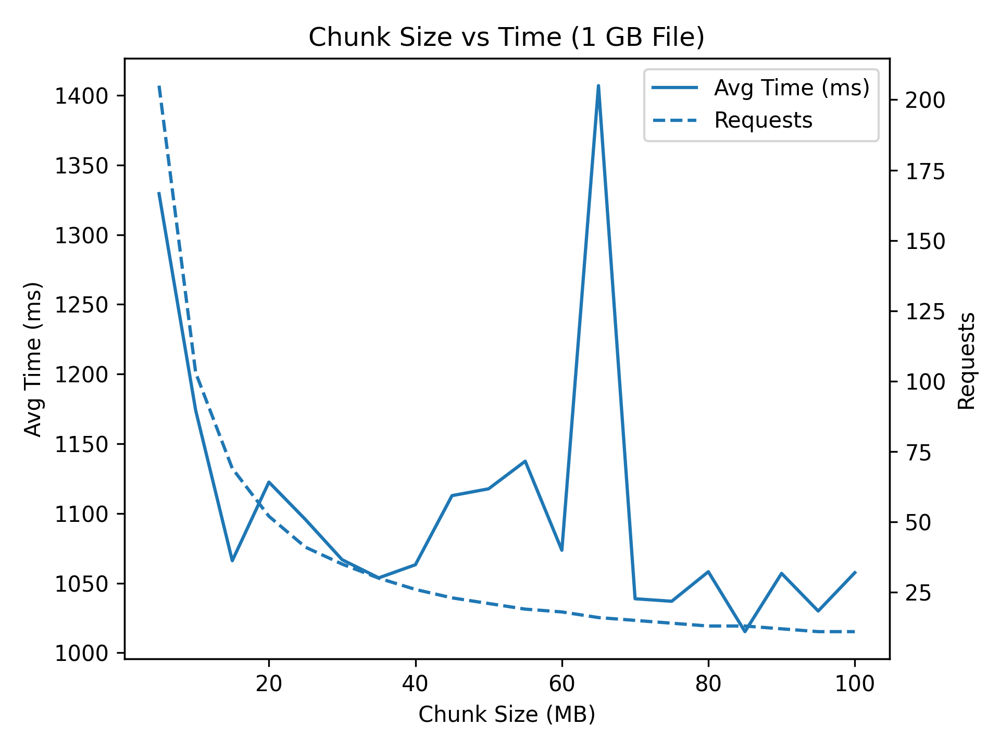

## Design Decisions

Insights in decisions that led me to this solution.

### Amount of threads per core

Source code: `ThreadScalingBenchmark`

Benchmark of downloading 1GB file, performed on localhost, one score is avg from 10 runs, not fixed chunk sizes.
I can conclude that 11 threads per core is most optimal or around 10MB per chunk.


### Size of chunk

To determine optimal size of chunk I performed single thread tests on two sizes of file. So in my first design
I used const variables:

```java
private static final long MIN_CHUNK = 50L * MB_SIZE;
private static final long MAX_CHUNK = 80L * MB_SIZE;
```

But it turned out that optimizing **chunk size & threads amount** for efficiency with no *out of RAM* jeopardy
requires more fine-tuning that I passed on eventually during implementation of this task and focused on reliability
and error handling.

At the end I decided to go with params that wouldn't cause RAM
shortage $(8 \text{ cores} \cdot 11 \cdot 10\,\text{MB} < 1\,\text{GB})$

```java
private static final long CHUNK_SIZE = 10 * MB_SIZE;
private static final int THREADS_PER_CORE = 11;
```




## Conclusion

Achieving optimal performance requires tuning of both chunk size and thread count. While this implementation uses
empirically chosen
defaults, a truly optimal solution would require dynamic adaptation based on runtime conditions.

In particular, further improvements could take into account:

* Available heap memory to prevent excessive RAM usage
* Network bandwidth and latency characteristics
* Specific use cases (e.g., large files vs many small files)

Given the scope of this task, I placed focus on building a reliable, correct, and resilient downloader rather than
fully optimizing these parameters.
